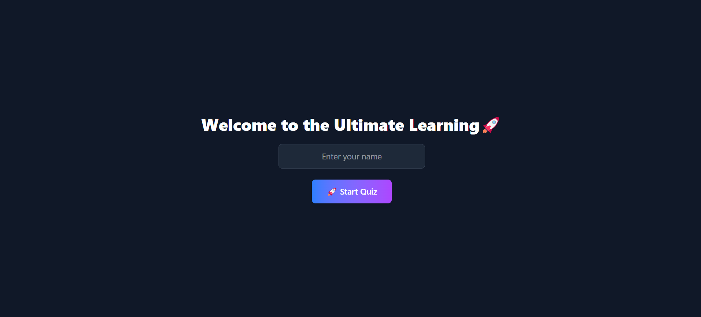
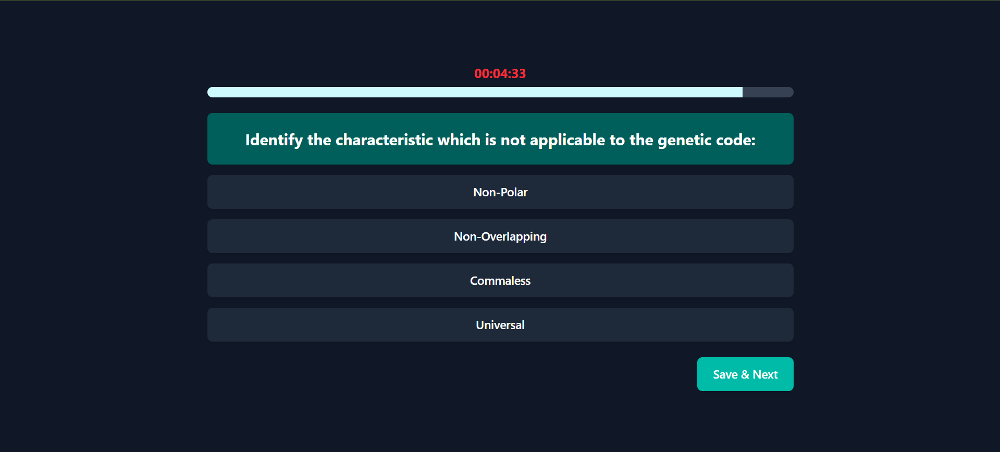
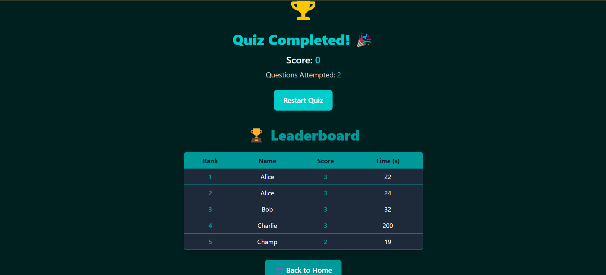

# 🎯 Quiz App with Gamification Features  

🚀 **A modern quiz app with animations, leaderboard, XP system, and a timer.**  

## 🌟 Live Demo  
👉 **[Click here to try the app](https://quiz-assignment-two.vercel.app/)**  

---

## 📸 Screenshots  
| Home Page | Quiz Page | Leaderboard |
|-----------|----------|-------------|
|  |  |  |

📽️ **Video Walkthrough:**  
[Watch the video](public/video.mp4)

---

## 🛠️ Features  
- ✅ Fetches quiz questions from an API  
- ✅ Live timer with progress animation  
- ✅ Global leaderboard using MongoDB  
- ✅ Fully responsive and modern UI  


---

## 🚀 Tech Stack  
- **Frontend:** React, Tailwind CSS, Framer Motion  
- **Backend:** Node.js, Express, MongoDB
- **Deployment:** Vercel (Frontend & Backend)  

---

## Setup Instructions  

### 1️⃣ Clone the repository 
```bash
git clone https://github.com/YOUR_GITHUB_USERNAME/quiz-app.git
cd quiz-app
```
### 2️⃣ Install dependencies
```bash
npm install
```
### 3️⃣ Set up environment variables
Create a .env file in the root directory and add:
```bash
MONGO_URI=your_mongodb_connection_string
```
### 4️⃣ Start the server
```bash
npm start
```
---
## API Endpoints

### Quiz API
- `GET /api/quiz`  
  - Fetches quiz questions from the backend.

### Leaderboard API
- `POST /api/leaderboard`  
  - Submits user quiz results (name, score, time).
- `GET /api/leaderboard`  
  - Retrieves the global leaderboard with all users' scores.
---

### Deployment
Frontend: Deployed on Vercel → [Live App](https://quiz-assignment-two.vercel.app/)
Backend: Deployed on Vercel → [API Endpoint](https://quiz-assignment-bkbt.vercel.app/)


